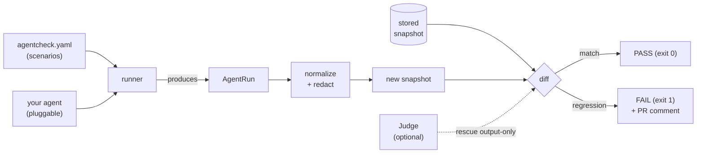

<div align="center">


# agentcheck

**Stop your AI agents from silently regressing — snapshot their tool-calls and fail CI when they change.**

_Built and maintained by **Viprasol Tech**._

[](https://github.com/Viprasol-Tech/agentcheck/actions/workflows/ci.yml)
[](https://www.npmjs.com/package/agentcheck)
[](LICENSE)
[](tsconfig.json)
[](test)
[](action.yml)

</div>

---

## What is this?

`agentcheck` is **Jest snapshots, but for AI agents.** It records an agent's
*behavior* — the ordered sequence of tool calls (name + arguments) plus the
final output — as a snapshot. Then on every pull request it re-runs your
scenarios and **diffs the new behavior against the stored snapshot**, failing
the build when your agent starts calling the wrong tool, passing the wrong
arguments, or producing a different answer.

It is **framework-agnostic** (OpenAI, Anthropic, LangGraph, MCP, or your own
loop), needs **no SaaS account**, and ships a **drop-in GitHub Action**. The
network and the LLM are behind pluggable interfaces with built-in fakes, so the
whole demo and the entire test suite run **offline with no API keys**.

> Your prompt tweak fixed one case. Did it quietly break five others? agentcheck tells you in CI.

## Demo

Record a baseline, then deliberately regress the agent and watch agentcheck
catch it. This is **real, copy-pasted output** from the bundled example
(`example/`):

```text
$ npx agentcheck update --dir example
agentcheck: wrote 2 snapshot(s) to example/.agentcheck/snapshots

$ npx agentcheck run --dir example          # nothing changed -> PASS
PASS   weather-in-paris
PASS   book-a-flight

agentcheck: 2 passed, 0 failed, 2 total
RESULT: PASS
```

Now the agent regresses — it geocodes Paris to the wrong country and forgets to
actually create the flight booking. `agentcheck run` fails CI and prints exactly
what changed:

```text
$ npx agentcheck run --dir example          # agent regressed -> FAIL (exit 1)
FAIL   weather-in-paris  (tolerant mode)
  ~ step[0] tool geocode args changed:
      args.country: FR -> DE
FAIL   book-a-flight  (tolerant mode)
  - step[2] removed tool call: create_booking
  ~ finalOutput changed:
      before: Booked flight UA-512 from SFO to JFK, seat 14C.
      after:  I found a flight from SFO to JFK.

agentcheck: 0 passed, 2 failed, 2 total
RESULT: FAIL
```

The same report renders as a PR comment via the GitHub Action:

> ## agentcheck — :x: FAIL
> **0 passed**, **2 failed** of 2 scenarios.
>
> | Scenario | Result | Details |
> | --- | --- | --- |
> | weather-in-paris | :x: | 1 changed |
> | book-a-flight | :x: | 1 removed, output changed |

## Quickstart

```bash
npm install --save-dev agentcheck
```

1. **Write an agent module** that maps a scenario to an `AgentRun` (the tool
   calls + final output your agent produced). Normalize provider payloads with
   the built-in adapters:

```ts
// myagent.ts
import { normalizeToolCalls, type AgentRun, type ScenarioDef } from "agentcheck";

export default async function agent(def: ScenarioDef): Promise<AgentRun> {
  const resp = await callYourAgent(def.input); // OpenAI / Anthropic / LangGraph / MCP
  return {
    scenario: def.name,
    input: def.input,
    steps: normalizeToolCalls("openai", resp.tool_calls),
    finalOutput: resp.content,
  };
}
```

2. **Declare scenarios** in `agentcheck.yaml`:

```yaml
agent: ./myagent.ts
mode: tolerant            # exact | tolerant
redact:                   # strip volatile fields before snapshotting
  - meta.runId
  - steps.*.meta.latencyMs
scenarios:
  - name: weather-in-paris
    input: What's the weather in Paris right now?
```

3. **Record** the baseline, commit it, then **check** on every change:

```bash
npx agentcheck update      # write/refresh snapshots (commit these)
npx agentcheck run         # compare; exits 1 on a regression
```

## Use it as a GitHub Action

```yaml
# .github/workflows/agentcheck.yml
name: agentcheck
on: pull_request
permissions:
  contents: read
  pull-requests: write
jobs:
  agentcheck:
    runs-on: ubuntu-latest
    steps:
      - uses: actions/checkout@v4
      - uses: Viprasol-Tech/agentcheck@v0.1.0
        with:
          dir: .            # folder containing agentcheck.yaml
          comment: "true"   # post/refresh a PR comment with the diff
```

| Input          | Default | Description                                              |
| -------------- | ------- | -------------------------------------------------------- |
| `dir`          | `.`     | Directory containing `agentcheck.yaml`.                  |
| `config`       | `""`    | Explicit path to the config (overrides `dir`).           |
| `agent`        | `""`    | Path to the agent module (overrides the config key).     |
| `comment`      | `true`  | Post / update a PR comment with the diff.                |
| `node-version` | `20`    | Node.js version to run with.                             |

Outputs: `result` (`pass`/`fail`) and `summary-file` (path to the markdown report).

## Features

- **Behavioral snapshots** — capture tool name + args + final output as stable,
  key-sorted JSON you commit to your repo.
- **Structured diffs** — added / removed / changed / renamed tool calls, per-arg
  field diffs, and output diffs — not an opaque string compare.
- **Redaction** — strip volatile fields (timestamps, ids, latency) with dotted
  paths and a `*` wildcard so reruns are deterministic.
- **Exact vs tolerant modes** — fail on any change, or ignore configured fields.
- **Optional LLM-as-judge** — a pluggable `Judge` can rescue output-only changes
  that are *semantically* equivalent (paraphrases). Ships a deterministic,
  offline fake judge.
- **Framework-agnostic adapters** — `normalizeToolCalls()` for OpenAI,
  Anthropic, and LangGraph tool-call shapes.
- **Drop-in GitHub Action** — composite action that runs in CI and comments the
  diff on the PR.
- **Zero SaaS, offline-first** — everything network/LLM-bound is an interface
  with a built-in fake. No account, no keys to run the demo or tests.

## How it works



## Roadmap

- [x] Stable snapshot serialization + redaction
- [x] Structured tool-call & output diffing (exact / tolerant)
- [x] YAML scenarios + CLI (`run` / `update`)
- [x] OpenAI / Anthropic / LangGraph adapters
- [x] Pluggable LLM-as-judge with offline fake
- [x] Composite GitHub Action with PR comments
- [ ] Native MCP server recorder (capture real tool traffic)
- [ ] HTML diff report artifact
- [ ] Parallel scenario execution
- [ ] Snapshot review UI (`agentcheck review`)

## FAQ

**Does this call an LLM or need API keys?**
No. The agent under test and the optional judge are pluggable interfaces with
built-in fakes. The demo and all 77 tests run fully offline. You bring your own
agent for real use.

**How is this different from a normal snapshot test?**
agentcheck understands *agent behavior*: it diffs the ordered tool calls and
their arguments structurally (added/removed/changed/renamed), redacts volatile
fields, and offers a semantic judge for prose outputs — instead of a brittle
whole-string compare.

**My agent is non-deterministic. Won't snapshots be flaky?**
Use `redact` to drop volatile fields, `tolerant` mode + `ignore` to skip fields
that legitimately vary, and the LLM-as-judge to accept paraphrased outputs.

**What frameworks are supported?**
Anything — you map your agent's output to an `AgentRun`. Adapters for OpenAI,
Anthropic, and LangGraph tool-call formats are included.

## Development

```bash
npm install
npm run typecheck   # tsc --noEmit, 0 errors
npm test            # vitest, 77 tests
npm run build       # emit dist/
```

## Star this repo

If agentcheck saved you from a silent agent regression, please **⭐ star the
repo** — it genuinely helps others find it. Thank you!

## Contact — Viprasol Tech Private Limited

- Website: [viprasol.com](https://viprasol.com)
- Email: [support@viprasol.com](mailto:support@viprasol.com)
- Telegram: [t.me/viprasol_help](https://t.me/viprasol_help) | WhatsApp: +91 96336 52112
- GitHub: [@Viprasol-Tech](https://github.com/Viprasol-Tech) | [LinkedIn](https://www.linkedin.com/in/viprasol/) | X [@viprasol](https://twitter.com/viprasol)

## License

[MIT](LICENSE) (c) 2025 Viprasol Tech Private Limited
